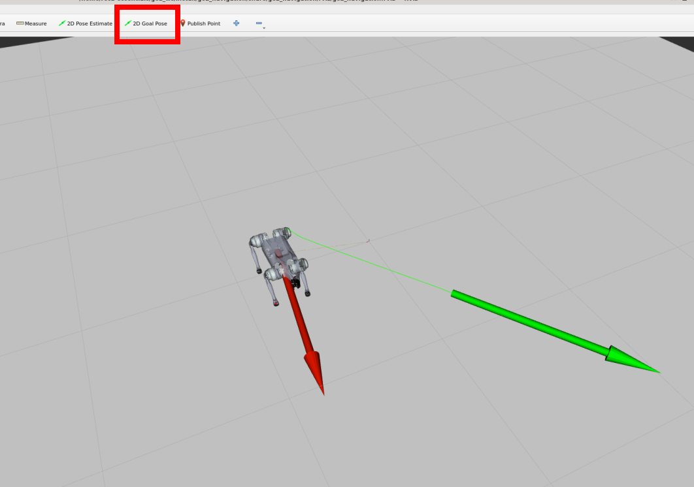
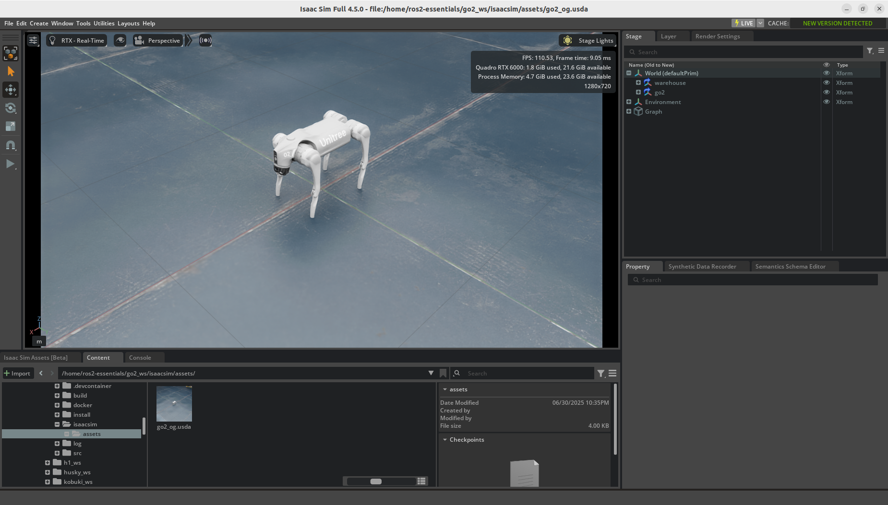
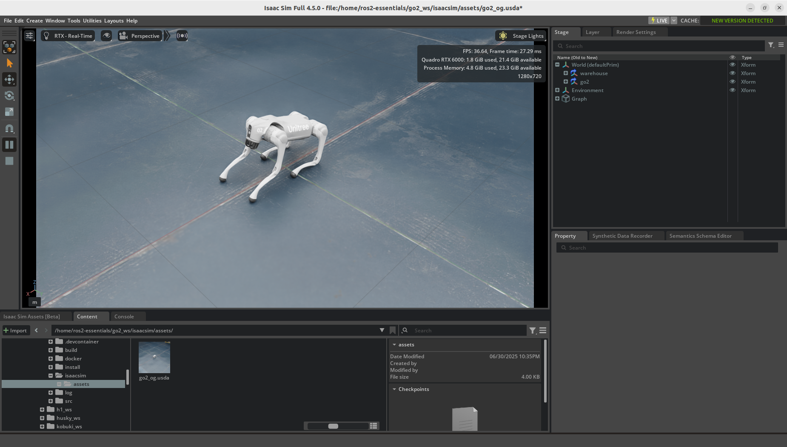
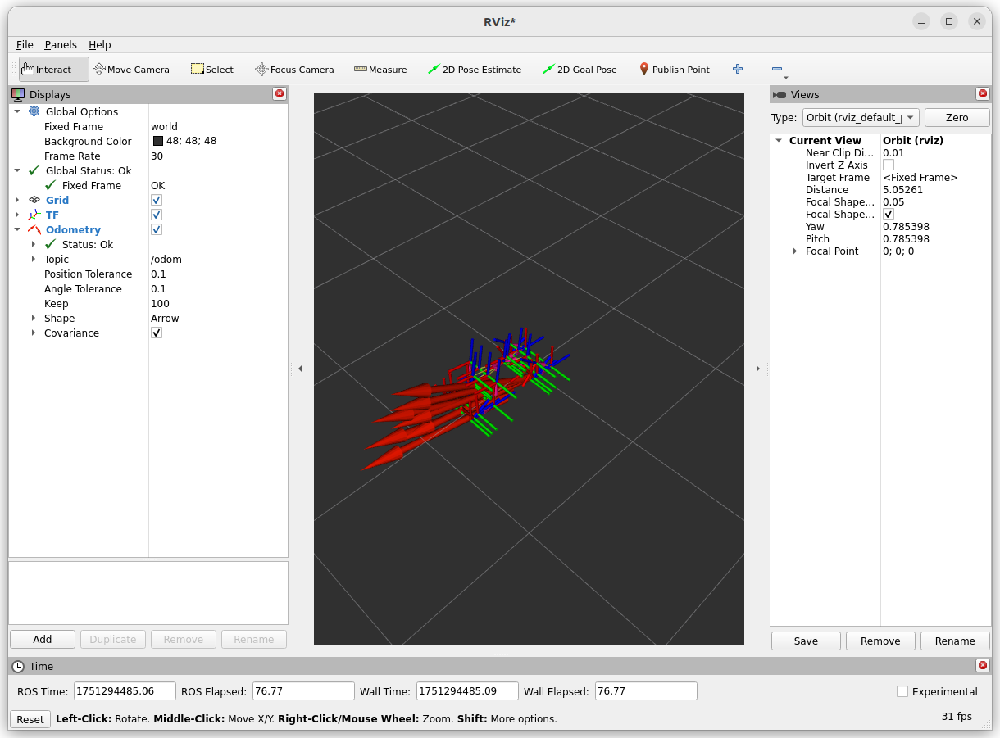

# Unitree Go2

[](https://github.com/j3soon/ros2-essentials/tree/main/go2_ws)
[](https://github.com/j3soon/ros2-essentials/actions/workflows/build-go2-ws.yaml)
[](https://github.com/j3soon/ros2-essentials/commits/main/go2_ws)

[](https://hub.docker.com/r/j3soon/ros2-go2-ws/tags)


> Please note that this workspace is only tested in simulation.

## Run the container

```bash
# Run the container
cd /home/ros2-essentials/go2_ws/docker
docker compose up -d --build
docker exec -it ros2-go2-ws bash
```

## Testing

### Isaac Lab Examples

[Training](https://isaac-sim.github.io/IsaacLab/main/source/overview/reinforcement-learning/rl_existing_scripts.html) [environments](https://isaac-sim.github.io/IsaacLab/main/source/overview/environments.html#comprehensive-list-of-environments) (`Isaac-Velocity-Flat-Unitree-Go2-v0`, `Isaac-Velocity-Rough-Unitree-Go2-v0`):

```sh
cd ~/IsaacLab
./isaaclab.sh -p scripts/reinforcement_learning/rsl_rl/train.py --task Isaac-Velocity-Rough-Unitree-Go2-v0 --headless
# or
./isaaclab.sh -p scripts/reinforcement_learning/skrl/train.py --task Isaac-Velocity-Rough-Unitree-Go2-v0 --headless
```

Run [pre-trained model inference](https://isaac-sim.github.io/IsaacLab/main/source/overview/reinforcement-learning/rl_existing_scripts.html):

```sh
cd ~/IsaacLab
./isaaclab.sh -p scripts/reinforcement_learning/rsl_rl/play.py --task Isaac-Velocity-Rough-Unitree-Go2-v0 --num_envs 32 --use_pretrained_checkpoint
```

### Champ Controller Demo

1. Launch the Go2 in the Isaac Sim.

```bash
ros2 launch go2_bringup go2_bringup.launch.py
```

2. Launch the Champ controller

```bash
ros2 launch champ_bringup go2.launch.py
```

> On the first launch, the Go2 in Isaac Sim may initially stand on its rear legs, which can cause it to fall backwards or sideways during the next step. To fix this, simply stop and restart the Isaac Sim simulation (leave the CHAMP controller running), then proceed with the remaining steps.

3. Send a command to the Go2

> We use the `teleop_twist_keyboard` for demonstration.  
> You can use any other method as well.

```bash
ros2 run teleop_twist_keyboard teleop_twist_keyboard
```

### Nav2 Demo with Champ Controller

> Note: This demo is only a quick verification that Nav2 can be used to control the Go2 to reach a target point. Many important steps, such as the Go2's odometry and SLAM, are omitted in this demonstration. In the current pipeline, Nav2 simply uses the ground-truth odometry data provided by Isaac Sim to control and move the Go2 to the target point.

1. Launch the Go2 in the Isaac Sim.

```bash
ros2 launch go2_bringup go2_bringup.launch.py
```

2. Launch the Champ controller

```bash
ros2 launch champ_bringup go2.launch.py
```

3. Launch the Nav2

```bash
ros2 launch go2_navigation go2_navigation.launch.py
```

You can use the `2D Goal Pose` in RViz to set the target position, then Nav2 will plan a path and control the Go2 to reach it.



### Custom Isaac Sim Environment

Run `~/isaacsim/isaac-sim.sh` and open `/home/ros2-essentials/go2_ws/isaacsim/assets/go2_og.usda` in Omniverse, and then press Play.




In another terminal, exec into the container:

```sh
docker exec -it ros2-go2-ws bash
```

Inspect the joint states and clock:

```sh
ros2 topic echo /joint_states
ros2 topic echo /clock
```

Inspect TF and Odom by launching `rviz2` and set `Fixed Frame` to `world` and `Add > TF`. Then, `Add > Odometry` and set `Topic` to `/odom`.


Send a joint command:

```sh
ros2 topic pub --once /joint_command sensor_msgs/msg/JointState "{
  name: [
    'FL_hip_joint', 'FR_hip_joint', 'RL_hip_joint', 'RR_hip_joint',
    'FL_thigh_joint', 'FR_thigh_joint', 'RL_thigh_joint', 'RR_thigh_joint',
    'FL_calf_joint', 'FR_calf_joint', 'RL_calf_joint', 'RR_calf_joint'
  ],
  position: [0.0, 0.0, 0.0, 0.0, 0.0, 0.0, 1.0, 1.0, 0.0, 0.0, 0.0, 0.0],
  velocity: [],
  effort: []
}"
```

The Go2 should move forward a little bit, which can be seen in both Isaac Sim and RViz2.



